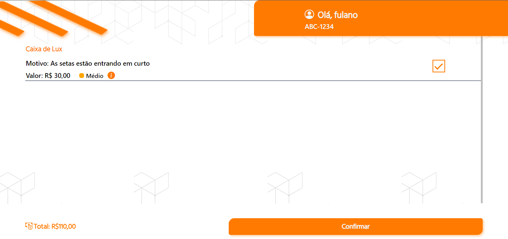

# mechanicUI - interface de APP de serviçoes
Um repositorio UI de um sistema de serviço de mecanico online em que o usuario verifica os serviços que deseja realizar, quando iniciava meus estudos em HTML, CSS e manipulação DOM em javaScript

# Imagens do Projeto

  

# Conhecimentos utilizados:

  
  
  
  
  

# Site para testar:
Mechanic - https://liedsonlb.github.io/mechanicUI/
